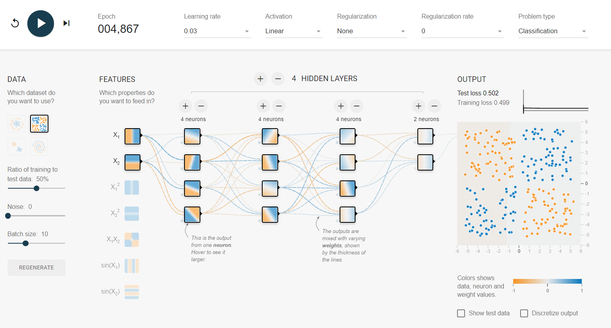
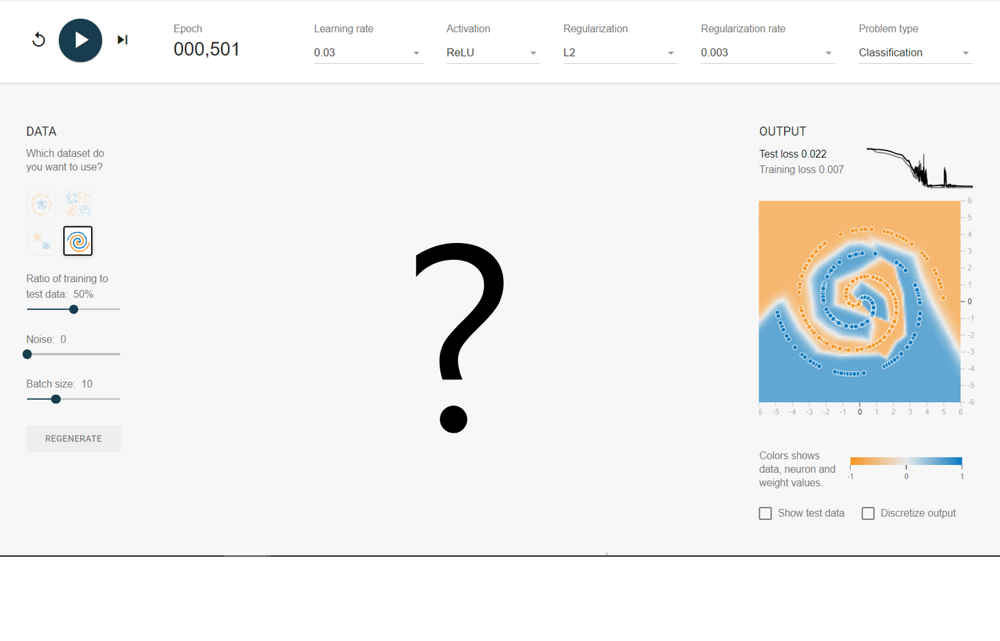

# 딥러닝 특론 과제 1

## 1. Classifying a XOR Datasets in TensorFlow Playground (40점)

TensorFlow Playground의 [XOR Classification](https://playground.tensorflow.org/#activation=linear&batchSize=10&dataset=xor&regDataset=reg-plane&learningRate=0.03&regularizationRate=0&noise=0&networkShape=4,4,4,2&seed=0.86458&showTestData=false&discretize=false&percTrainData=50&x=true&y=true&xTimesY=false&xSquared=false&ySquared=false&cosX=false&sinX=false&cosY=false&sinY=false&collectStats=false&problem=classification&initZero=false&hideText=false)에 접속하여

(***주의***: 링크를 클릭하여 접속하셔야 제가 만들어놓은 구조를 확인하실 수 있습니다.)

학습버튼 (재생버튼)을 눌러보면, 학습이 원활하게 이뤄지지 않는 것을 알 수 있습니다.

- 4개의 히든레이어를 가지고 있으며 각 히든레이어에는 뉴런의 수도 충분히 많음에도 학습이 이뤄지지 않은 이유를 밝히고 (20점),
- 이 구조를 수정하여 원활한 Classification이 이루어질 수 있는 구조를 제시하십시오. (20점)
  - 위 그림과 같이 Learning rate 등의 Hyperparameter들과 망 구조, Classification 결과 가 모두 보이도록 화면을 캡쳐하여 제출해주십시오.

## 2. Classifying a XOR Datasets in TensorFlow Playground (60점)

Tensorflow Playground의 [Spiral Classification](https://playground.tensorflow.org/#activation=tanh&batchSize=10&dataset=spiral&regDataset=reg-plane&learningRate=0.03&regularizationRate=0&noise=0&networkShape=4,2&seed=0.82204&showTestData=false&discretize=false&percTrainData=50&x=true&y=true&xTimesY=false&xSquared=false&ySquared=false&cosX=false&sinX=false&cosY=false&sinY=false&collectStats=false&problem=classification&initZero=false&hideText=false)에 접속하여 아래와 같이 Test loss는 0.025, Training loss는 0.001이하로 학습시키는 망 구조를 제시하시하되, 아래 제한 조건을 준수하십시오.

- 위 그림과 같이 Learning rate 등의 Hyperparameter들과 망 구조, Classification 결과 가 모두 보이도록 화면을 캡쳐하여 제출해주십시오 (60점)
 
- 제한 조건
  - Epoch: 700 이하
  - Test loss: 0.025 이하
  - Training loss 0.001이하
  - Learning Rate: 0.03 사용